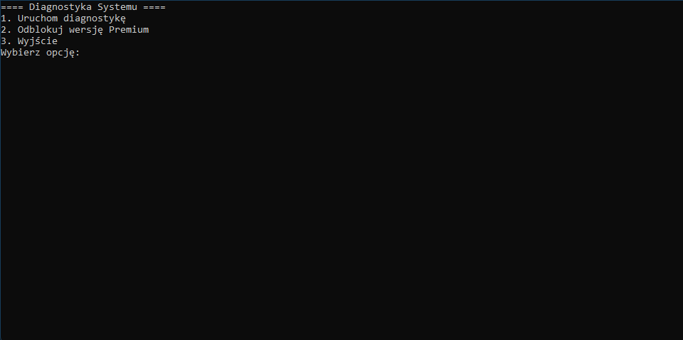

# 🛠 Diagnostyka Systemu (Python)



> Zaawansowane narzędzie diagnostyczne dla systemu Windows

## 📦 Opis projektu

`diagnostyka.py` to interaktywny skrypt stworzony w Pythonie, który umożliwia użytkownikowi szybkie przeskanowanie systemu Windows, wykrycie problemów, oraz opcjonalne zapisanie wyników do pliku.

---

## 🔧 Funkcje

- ✅ Diagnostyka systemu operacyjnego (komendy `ver`, `wmic`, `sfc`)
- ✅ Skanowanie i analiza sterowników (`pnputil /enum-drivers`)
- ✅ Zapis wyników do pliku `.txt`
- ✅ Prosty interfejs tekstowy (CLI)

---

## 💡 Jak używać?

1. **Zainstaluj zależność:**
   ```bash
   pip install cryptography
   ```

2. **Uruchom jako administrator:**
   ```bash
   python diagnostyka.py
   ```

3. **Korzystaj z menu:**
   - `1` – Uruchamia diagnostykę
   - `2` – Odblokowuje Premium
   - `3` – Zamyka aplikację

> **Uwaga:** O klucz Premium można zapytać się właściciela.

---

## 📂 Struktura projektu

```
📁 diagnostyka/
├── diagnostyka.py         # Główny skrypt
├── README.md              # Ten plik
├── screenshot.png         # Zrzut ekranu (jeśli chcesz)
```

---

## 🧪 Wymagania

- Python 3.7+
- System Windows
- Uprawnienia administratora
- Biblioteka `cryptography`

---

## 📃 Licencja

Projekt dostępny na licencji MIT – możesz używać, modyfikować i rozpowszechniać dowolnie, z zachowaniem informacji o autorze.

---

## 👤 Autor

Projekt stworzony przez **MARCINASMRYT**
